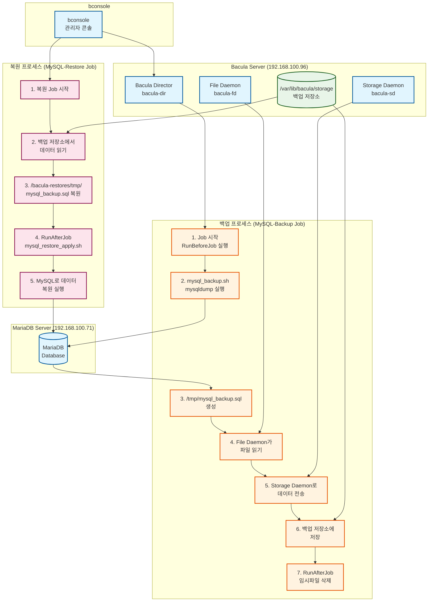

```mermaid
graph TD
    %% 서버 정의
    subgraph "MariaDB Server (192.168.100.71)"
        MDB[(MariaDB<br/>Database)]
    end
    
    subgraph "Bacula Server (192.168.100.96)"
        DIR[Bacula Director<br/>bacula-dir]
        SD[Storage Daemon<br/>bacula-sd]
        FD[File Daemon<br/>bacula-fd]
        STORAGE[(/var/lib/bacula/storage<br/>백업 저장소)]
    end
    
    subgraph "bconsole"
        BC[bconsole<br/>관리자 콘솔]
    end
    
    %% 백업 프로세스
    subgraph "백업 프로세스 (MySQL-Backup Job)"
        B1[1. Job 시작<br/>RunBeforeJob 실행]
        B2[2. mysql_backup.sh<br/>mysqldump 실행]
        B3[3. /tmp/mysql_backup.sql<br/>생성]
        B4[4. File Daemon가<br/>파일 읽기]
        B5[5. Storage Daemon로<br/>데이터 전송]
        B6[6. 백업 저장소에<br/>저장]
        B7[7. RunAfterJob<br/>임시파일 삭제]
    end
    
    %% 복원 프로세스
    subgraph "복원 프로세스 (MySQL-Restore Job)"
        R1[1. 복원 Job 시작]
        R2[2. 백업 저장소에서<br/>데이터 읽기]
        R3[3. /bacula-restores/tmp/<br/>mysql_backup.sql 복원]
        R4[4. RunAfterJob<br/>mysql_restore_apply.sh]
        R5[5. MySQL로 데이터<br/>복원 실행]
    end
    
    %% 연결 관계 - 백업
    BC --> DIR
    DIR --> B1
    B1 --> B2
    B2 --> MDB
    MDB --> B3
    B3 --> B4
    FD --> B4
    B4 --> B5
    SD --> B5
    B5 --> B6
    STORAGE --> B6
    B6 --> B7
    
    %% 연결 관계 - 복원
    BC --> R1
    R1 --> R2
    STORAGE --> R2
    R2 --> R3
    R3 --> R4
    R4 --> R5
    R5 --> MDB
    
    %% 스타일링
    classDef server fill:#e1f5fe,stroke:#01579b,stroke-width:2px
    classDef process fill:#f3e5f5,stroke:#4a148c,stroke-width:2px
    classDef storage fill:#e8f5e8,stroke:#1b5e20,stroke-width:2px
    classDef backup fill:#fff3e0,stroke:#e65100,stroke-width:2px
    classDef restore fill:#fce4ec,stroke:#880e4f,stroke-width:2px
    
    class MDB,DIR,SD,FD,BC server
    class STORAGE storage
    class B1,B2,B3,B4,B5,B6,B7 backup
    class R1,R2,R3,R4,R5 restore

```
